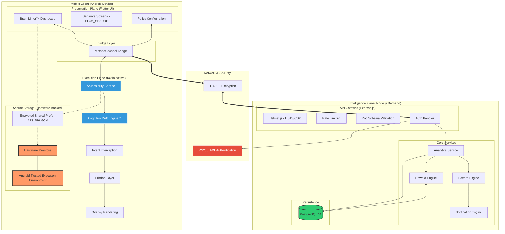

# ReClaim™ System Architecture Flowchart

This diagram illustrates the multi-plane architecture of the ReClaim platform, highlighting the interaction between the **Execution Plane** (Native Android), the **Presentation Plane** (Flutter), and the **Intelligence Plane** (TypeScript Backend).

### Component Breakdown

| Layer | Component | Description |
| :--- | :--- | :--- |
| **Execution Plane** | Accessibility Service | System-level listener monitoring app transitions and interactions. |
| | Cognitive Drift Engine™ | Real-time processor for interaction velocity and behavioral fragmentation. |
| | Friction Layer | Implements intentional latency and reflection prompts before distraction. |
| **Presentation Plane** | Brain Mirror™ Dashboard | High-fidelity Flutter UI providing cognitive insights and data viz. |
| | Secure Screens | Uses `FLAG_SECURE` to prevent unauthorized snapshots/recordings. |
| **Intelligence Plane** | Analytics Service | Backend processor for weekly reports and longitudinal drift tracking. |
| | Reward Engine | Calculates behavioral bonuses and autonomy scores. |
| | PostgreSQL | Hardened persistence layer with `pg-query-stream` for performance. |
| **Security Layer** | Hardware Keystore | RS256 keys stored in the device's Trusted Execution Environment (TEE). |
| | RS256 JWT | Asymmetric authentication ensuring non-repudiation and integrity. |
