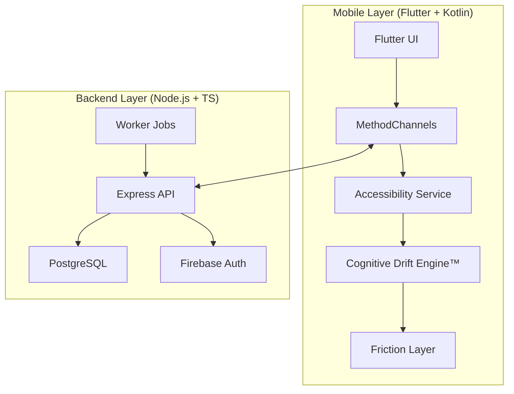

# ReClaim™ — Behavioral Intelligence & Digital Autonomy

[](https://opensource.org/licenses/MIT)
[]()
[]()
[]()

> **Digital addiction is a design problem. ReClaim is the engineering solution.**

ReClaim is a high-performance behavioral enforcement platform designed to break the dopamine feedback loops of modern mobile interfaces. Unlike traditional "focus apps" that rely on user willpower, ReClaim utilizes low-level Android system hooks to implement physical friction and cognitive intelligence.

---

## 🏗️ System Architecture

ReClaim operates on a tiered architecture combining cross-platform flexibility with native-level enforcement.



## 🧠 Core Intelligence: The Cognitive Drift Engine™

The **Cognitive Drift Engine™** is a proprietary behavioral analysis system that measures the "fragmentation" of human attention. It tracks:

- **Fragmentation Index**: The rate of context switching between high-utility and high-distraction packages.
- **Craving Windows**: Predictive modeling of when a user is most likely to experience a behavioral lapse.
- **Drift Score**: A real-time metric of attention decay based on interaction velocity and session depth.

## 🛡️ Enforcement Mechanisms

### 1. The Friction Layer
ReClaim implements an intentional "latency bridge" using Android Accessibility Services. When a user attempts to open a restricted package, ReClaim injects a customizable delay (Smart Friction) that forces the prefrontal cortex to re-engage before the dopamine hit.

### 2. Hard Blocking
During "Deep Focus" sessions, ReClaim executes kernel-level-style intent interception. Attempted breaches are immediately redirected to a reflection prompt, making it functionally impossible to bypass without a cooling-off period.

### 3. Brain Mirror™ Dashboard
A high-fidelity visualization suite that mirrors the user's cognitive state back to them. It surfaces latent behavioral patterns that are normally invisible to the user.

---

## 🔒 Security & Privacy

ReClaim is built on a "Zero Trust" behavioral model:

- **RS256 Asymmetric JWT**: All backend communication is signed using RSA-256 asymmetric keys.
- **Android Keystore Integration**: Sensitive tokens are stored in the hardware-backed Android Keystore, never in plain text.
- **FLAG_SECURE Enforcement**: The app prevents screen capture and window leakage during sensitive operations.
- **Audit Logging**: Every policy override and session transition is logged for behavioral integrity.

---

## 🚀 Getting Started

### Prerequisites
- **Docker & Docker Compose**
- **Flutter SDK (v3.22+)**
- **Android Studio / IntelliJ** (with Android device running API 29+)

### Local Development Setup

1. **Infrastructure**:
   ```bash
   docker-compose up -d
   ```

2. **Backend Configuration**:
   Navigate to `services/api/`, copy `.env.example` to `.env`, and populate the required fields.
   ```bash
   npm install
   npm run build
   npm start
   ```

3. **Mobile Deployment**:
   Open `apps/mobile` in your IDE.
   ```bash
   flutter pub get
   flutter run
   ```

---

## 📄 License

This project is licensed under the MIT License - see the [LICENSE](LICENSE) file for details.

---

## 🤝 Contributing

We welcome contributions from the engineering community. Please see our [CONTRIBUTING.md](CONTRIBUTING.md) for architectural guidelines and code standards.

---
*ReClaim is a research-grade tool for behavioral autonomy. Use with intent.*
