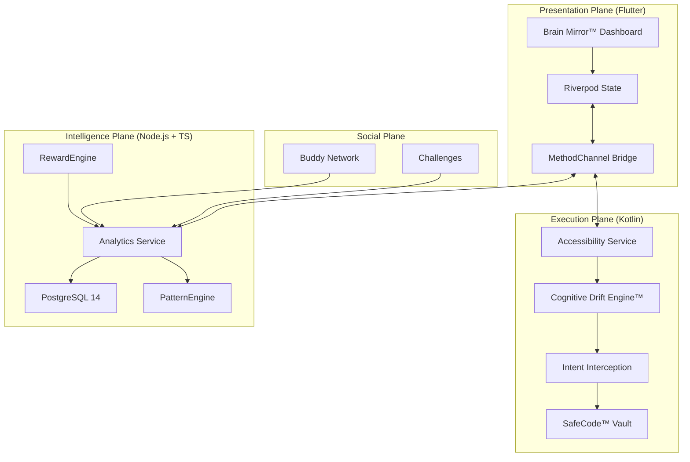

# ReClaim™ — Behavioral Intelligence & Digital Autonomy

> **Digital addiction is a design problem. ReClaim is the engineering solution.**

ReClaim is a high-performance behavioral enforcement platform designed to break the dopamine feedback loops of modern mobile interfaces. Unlike traditional "focus apps" that rely on user willpower, ReClaim utilizes low-level Android system hooks to implement physical friction, cognitive intelligence, and social accountability.

---

## 🏗️ System Architecture

ReClaim operates on a tiered architecture combining cross-platform flexibility with native-level enforcement.

---

## 🧠 Core Features

### 1. The Cognitive Drift Engine™ (CDE)
A proprietary behavioral analysis system that measures the "fragmentation" of human attention.
- **Fragmentation Index**: Measures the rate of context switching between high-utility and high-distraction apps.
- **Drift Score**: A real-time metric of attention decay based on interaction velocity and session depth.
- **Craving Windows**: Predictive modeling of high-risk periods for behavioral lapses.

### 2. Variable Latency Friction
ReClaim injects an intentional "latency bridge" using Android Accessibility Services. The delay scales dynamically based on your **Drift Score**—the more fatigued your brain, the more friction you encounter.

### 3. SafeCode™ Emergency Barrier
During "Deep Focus" sessions, ReClaim executes intent interception. Attempted breaches are redirected to a secure wall requiring a 4-digit code stored in the hardware-backed **Android Keystore (TEE)**.

### 4. Social Accountability Network
Connect with "Buddies" to create a collective discipline field. Share streaks and participate in community focus challenges without sacrificing granular privacy.

---

## 🛡️ Security & Privacy

ReClaim is built on a **Zero Trust** behavioral model:
- **RS256 Asymmetric JWT**: All backend communication is signed using RSA-256 asymmetric keys.
- **Hardware-Backed Privacy**: Sensitive tokens and SafeCodes are stored in the TEE.
- **Minimalist Permissions**: Accessibility services are configured with `canRetrieveWindowContent = false`. We track interaction patterns, not content.

---

## 🚀 Getting Started

### 📦 Prerequisites
- **Docker & Docker Compose**
- **Flutter SDK (v3.22+)**
- **Android Studio** (Device running API 29+)

### 🛠️ Quick Setup
1.  **Infrastructure**: `docker-compose up -d`
2.  **Environment**: Run `./reclaim-setup.ps1` to inject keys and run migrations.
3.  **Backend**: `cd services/api && npm install && npm start`
4.  **Mobile**: `cd apps/mobile && flutter run`

---

## 📂 Project Structure (For Judges)

| Folder | Mission |
| :--- | :--- |
| **`apps/mobile`** | **Production Plane**: Flutter Dashboard + Kotlin Interception Engines. |
| **`services/api`** | **Intelligence Plane**: Node.js Backend with RS256 Auth & Analytics. |
| **`docs/`** | **Knowledge Plane**: PRD, TRD, Algorithms, and Security Specs. |
| **`apps/android-native`** | **R&D Sandbox**: Standalone native core for system-level testing. |

---

## 📄 License
MIT License - see [LICENSE](LICENSE) for details.

---
*ReClaim — Reclaiming the human focus through engineering. v2.1.0 (May 14, 2026)*
