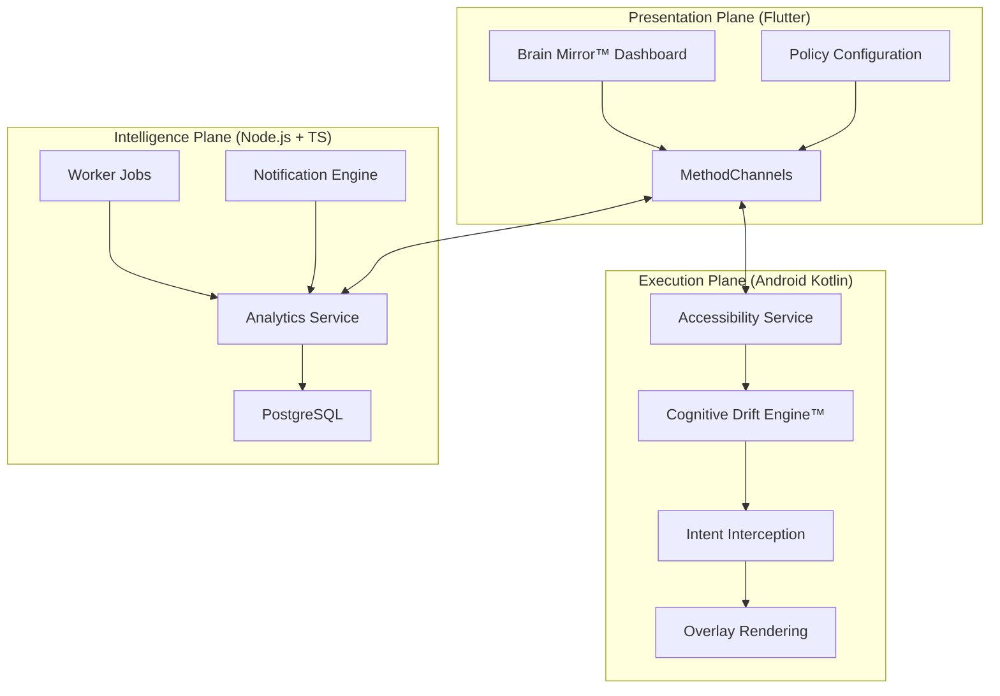

# ReClaim™ System Architecture

ReClaim is a high-performance behavioral autonomy platform utilizing a tiered architecture that spans from low-level Android system hooks to a hardened TypeScript backend.

---

## 🏗️ High-Level Overview

ReClaim is divided into three primary planes: the **Execution Plane** (Mobile Native), the **Presentation Plane** (Flutter), and the **Intelligence Plane** (Backend Services).

---

## 📱 Mobile Architecture

### 1. The Native Core (Kotlin)
- **Accessibility Enforcement**: Monitors package transitions and UI interactions. Unlike standard apps, ReClaim operates as a system-level listener.
- **Friction Layer**: Implements intentional latency and asynchronous reflection prompts before high-distraction apps are permitted to load.
- **Cognitive Drift Engine™**: Performs real-time processing of interaction velocity and fragmentation indices.

### 2. The Flutter Shell
- **Reactive UI**: Provides high-fidelity data visualizations of drift metrics.
- **MethodChannel Bridge**: Orchestrates communication between the Dart event loop and the native Android enforcement services.

---

## 💻 Backend Architecture

The backend follows a **Clean Layered Service** pattern:

1.  **Presentation Layer**: Express.js routes protected by RS256 JWT and Zod schema validation.
2.  **Service Layer**: Orchestrates business logic, including reward calculations and weekly report generation.
3.  **Domain Layer**: Contains pure business logic engines (PatternEngine, RewardEngine) and shared types.
4.  **Persistence Layer**: PostgreSQL 14 utilizing `pg-query-stream` for efficient data export and analysis.

---

## 🛡️ Security Model

- **Asymmetric Authentication**: Identity is managed via RS256 JWTs. The backend holds the private key; the mobile client validates sessions using a hardware-backed public key reference.
- **Hardware-Backed Privacy**: All local encryption keys are generated and stored in the Android Trusted Execution Environment (TEE).
- **Communication**: TLS-encrypted traffic with strict header enforcement (HSTS, CSP).

---
*Document Version: 1.1.0*
*Last Updated: May 2026*
