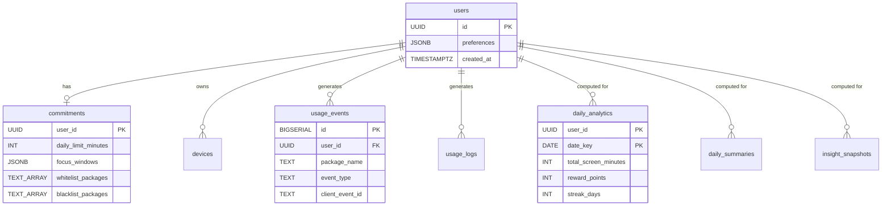

# Database Schema — Production Reference

Current as of: May 3, 2026  
PostgreSQL 18.3 | Database: `reclaim_db`

---

## Quick Stats

| Metric | Value |
|---|---|
| Tables | 9 (8 data + 1 migration tracking) |
| Indexes | 17 (8 PKs + 9 custom) |
| Functions | 2 (`cleanup_old_events`, `get_current_streak`) |
| Migrations | 4 applied (`001_init`, `002_analytics_upgrade`, `003_production_hardening`, `003_device_registry`) |

---

## Tables

### `schema_migrations`
Tracks which SQL migrations have been applied. Prevents re-running.

| Column | Type | Constraints |
|---|---|---|
| `version` | TEXT | **PK** |
| `name` | TEXT | NOT NULL DEFAULT '' |
| `applied_at` | TIMESTAMPTZ | NOT NULL DEFAULT NOW() |

---

### `users`
Registered user accounts.

| Column | Type | Constraints |
|---|---|---|
| `id` | UUID | **PK** |
| `preferences` | JSONB | NOT NULL DEFAULT '{}' |
| `created_at` | TIMESTAMPTZ | NOT NULL DEFAULT NOW() |

---

### `commitments`
Each user's ReClaim rules (1:1 with users).

| Column | Type | Constraints |
|---|---|---|
| `user_id` | UUID | **PK**, FK → `users(id)` ON DELETE CASCADE |
| `daily_limit_minutes` | INTEGER | NOT NULL, CHECK (15–1440) |
| `focus_windows` | JSONB | NOT NULL DEFAULT '[]' |
| `whitelist_packages` | TEXT[] | NOT NULL DEFAULT '{}' |
| `blacklist_packages` | TEXT[] | NOT NULL DEFAULT '{}' |
| `allow_whatsapp` | BOOLEAN | NOT NULL DEFAULT TRUE |
| `max_overrides_per_day` | INTEGER | NOT NULL DEFAULT 2, CHECK (0–10) |
| `reward_system_enabled` | BOOLEAN | NOT NULL DEFAULT TRUE |
| `created_at` | TIMESTAMPTZ | NOT NULL DEFAULT NOW() |
| `updated_at` | TIMESTAMPTZ | NOT NULL DEFAULT NOW() |

---

### `usage_events`
Raw event stream ingested from Android device sync. Source of truth for all analytics computation.

| Column | Type | Constraints |
|---|---|---|
| `id` | BIGSERIAL | **PK** |
| `user_id` | UUID | NOT NULL, FK → `users(id)` ON DELETE CASCADE |
| `package_name` | TEXT | NOT NULL |
| `started_at` | TIMESTAMPTZ | NOT NULL |
| `ended_at` | TIMESTAMPTZ | NOT NULL |
| `duration_seconds` | INTEGER | NOT NULL, CHECK (≥ 0) |
| `event_type` | TEXT | NOT NULL, CHECK IN ('usage', 'blocked_attempt', 'override') |
| `metadata` | JSONB | NOT NULL DEFAULT '{}' |
| `client_event_id` | TEXT | Nullable. Used for idempotent dedup. |
| `created_at` | TIMESTAMPTZ | NOT NULL DEFAULT NOW() |

**Indexes:**
- `usage_events_user_started_idx` — `(user_id, started_at DESC)` — fast date-range queries
- `usage_events_idempotency_idx` — `UNIQUE (user_id, client_event_id) WHERE client_event_id IS NOT NULL` — prevents duplicate ingestion
- `usage_events_user_type_idx` — `(user_id, event_type, started_at DESC)` — fast blocked/override counting

---

### `usage_logs`
Normalized usage records with category classification. Populated alongside `usage_events` during ingestion.

| Column | Type | Constraints |
|---|---|---|
| `id` | BIGSERIAL | **PK** |
| `user_id` | UUID | NOT NULL, FK → `users(id)` ON DELETE CASCADE |
| `app_name` | TEXT | NOT NULL |
| `category` | TEXT | NOT NULL DEFAULT 'other', CHECK IN ('social', 'communication', 'productivity', 'entertainment', 'utility', 'other') |
| `start_time` | TIMESTAMPTZ | NOT NULL |
| `end_time` | TIMESTAMPTZ | NOT NULL |
| `duration_seconds` | INTEGER | NOT NULL, CHECK (≥ 0) |
| `created_at` | TIMESTAMPTZ | NOT NULL DEFAULT NOW() |

**Indexes:**
- `usage_logs_user_start_idx` — `(user_id, start_time DESC)` — fast time-range queries
- `usage_logs_user_category_idx` — `(user_id, category, start_time DESC)` — fast category breakdown
- `usage_logs_dedup_idx` — `UNIQUE (user_id, app_name, start_time, end_time)` — prevents duplicate records on re-sync

---

### `daily_analytics`
Computed daily metrics, reward points, and pattern insights. Recomputed from `usage_events` each time daily analytics is requested.

| Column | Type | Constraints |
|---|---|---|
| `user_id` | UUID | NOT NULL, FK → `users(id)` ON DELETE CASCADE |
| `date_key` | DATE | NOT NULL |
| `total_screen_minutes` | INTEGER | NOT NULL DEFAULT 0 |
| `blocked_attempts` | INTEGER | NOT NULL DEFAULT 0 |
| `overrides_used` | INTEGER | NOT NULL DEFAULT 0 |
| `distraction_minutes` | INTEGER | NOT NULL DEFAULT 0 |
| `focus_minutes` | INTEGER | NOT NULL DEFAULT 0 |
| `late_night_minutes` | INTEGER | NOT NULL DEFAULT 0 |
| `app_switches` | INTEGER | NOT NULL DEFAULT 0 |
| `reward_points` | INTEGER | NOT NULL DEFAULT 0 |
| `streak_days` | INTEGER | NOT NULL DEFAULT 0 |
| `badges` | TEXT[] | NOT NULL DEFAULT '{}' |
| `insights` | JSONB | NOT NULL DEFAULT '{}' |
| `updated_at` | TIMESTAMPTZ | NOT NULL DEFAULT NOW() |

**PK:** `(user_id, date_key)`  
**Indexes:**
- `daily_analytics_streak_idx` — `(user_id, date_key DESC)` — fast streak lookups

---

### `daily_summaries`
Pre-computed app and category breakdowns for the Flutter UI charts.

| Column | Type | Constraints |
|---|---|---|
| `user_id` | UUID | NOT NULL, FK → `users(id)` ON DELETE CASCADE |
| `date_key` | DATE | NOT NULL |
| `total_screen_time_minutes` | INTEGER | NOT NULL DEFAULT 0 |
| `category_breakdown` | JSONB | NOT NULL DEFAULT '[]' |
| `app_breakdown` | JSONB | NOT NULL DEFAULT '[]' |
| `updated_at` | TIMESTAMPTZ | NOT NULL DEFAULT NOW() |

**PK:** `(user_id, date_key)`

---

### `insight_snapshots`
Daily recommendation snapshots — peak usage hour, flags, and AI-style suggestions.

| Column | Type | Constraints |
|---|---|---|
| `user_id` | UUID | NOT NULL, FK → `users(id)` ON DELETE CASCADE |
| `date_key` | DATE | NOT NULL |
| `peak_usage_hour` | INTEGER | NOT NULL DEFAULT 0, CHECK (0–23) |
| `excessive_usage_flags` | TEXT[] | NOT NULL DEFAULT '{}' |
| `recommendation_summary` | JSONB | NOT NULL DEFAULT '[]' |
| `created_at` | TIMESTAMPTZ | NOT NULL DEFAULT NOW() |

**PK:** `(user_id, date_key)`

### `devices`
Tracks hardware registration and sync status for each user.

| Column | Type | Constraints |
|---|---|---|
| `id` | UUID | **PK**, DEFAULT `gen_random_uuid()` |
| `user_id` | UUID | NOT NULL, FK → `users(id)` ON DELETE CASCADE |
| `device_id` | TEXT | NOT NULL |
| `model` | TEXT | Nullable |
| `os_version` | TEXT | Nullable |
| `fcm_token` | TEXT | Nullable |
| `last_sync_at` | TIMESTAMPTZ | NOT NULL DEFAULT NOW() |

**Unique Constraints:**
- `devices_user_device_key` — `UNIQUE (user_id, device_id)`

**Indexes:**
- `idx_devices_user_id` — `(user_id)` — fast lookup for user devices

---

## Functions

### `cleanup_old_events(retention_days INTEGER DEFAULT 90)`
Deletes raw events older than the specified retention period. Returns the count of deleted rows.

```sql
SELECT cleanup_old_events(90);  -- deletes events older than 90 days
```

### `get_current_streak(p_user_id UUID)`
Returns the latest streak day count for a user.

```sql
SELECT get_current_streak('d290f1ee-6c54-4b01-90e6-d701748f0851');  -- returns INTEGER
```

---

## Entity Relationship Diagram



---

## Data Retention

| Table | Retention | Method |
|---|---|---|
| `usage_events` | 90 days | `cleanup_old_events(90)` — run manually or via cron |
| `usage_logs` | 90 days | Same function cleans both tables |
| `daily_analytics` | Indefinite | Kept for long-term trend analysis |
| `daily_summaries` | Indefinite | Kept for chart data |
| `insight_snapshots` | Indefinite | Kept for recommendation history |


